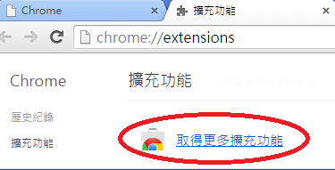

# 如何安裝及開啟文字編輯caret

我們會使用「Caret」文字編輯器，Google Chrome的一個擴充功能，在當中輸入html碼用以製作網0頁檔案。

- 步驟1

先開啟Chrome瀏覽器，然後按右上的「自訂及管理」。

- 步驟2

然後按「更多工具」--> 「擴充功能」

- 步驟3

然後按「取得更多擴充功能」，如下所示:

- 步驟4

在搜尋的方塊中輸入caret，然後按「Enter」，如下:

- 步驟5

然後選擇「Caret-T」，再按「加到Chrome」:

- 步驟6

- 