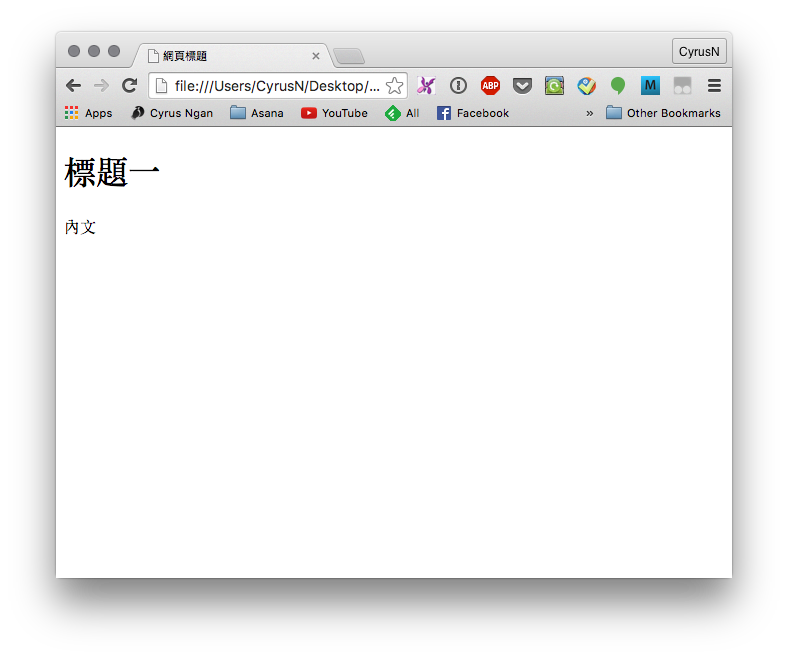
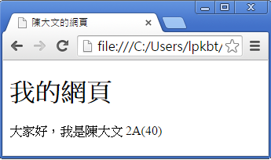
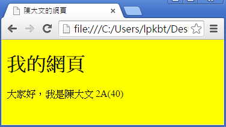
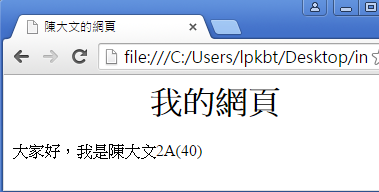
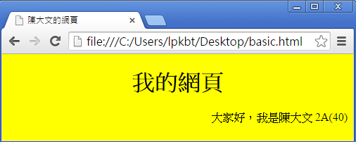

# 甚麼是html？
- HTML是用來製作網頁的標記語言
- HTML是Hypertext Markup Language的英文縮寫，即超文本標記語言
- HTML語言是一種標記語言，需要編譯，接由瀏覽器執行
- HTML文件是一個文本文件，含了一些HTML元素，標籤等.HTML文件必須使用html或htm為文件後綴名
- HTML是大小寫不敏感的，HTML與html是一樣的。


## 堂課1:

``` html
<!DOCTYPE html>
<html>
  <head>
    <meta charset="utf8">
    <title>網頁標題</title>
  </head>

  <body>
    <h1>標題一</h1>
    <p>內文</p>
  </body>
</html>
```
建立 `basic.html`，複製並貼上以上文字，利用瀏覽器開啟`basic.html`。



現在解釋一下上面的例子

- `<!DOCTYPE html>`代表文檔類型，大致的意思就是「這個網頁是HTML文檔」。
- `<meta charset="utf8">` 代表文檔編碼為`utf-8`
- HTML文檔中，一個標籤是`<html>`。這個標簽告訴瀏覽器這是HTML文檔的開始。
- HTML文檔的最後一個標籤是`</html>`，這個標簽告訴瀏覽器這是HTML文檔的終止。
- HTML head 標籤通常放在網頁的開頭。標準的 head 標籤會用一個 `<head>` 作為開頭，再以一個 `</head>` 標籤作為結尾，兩個標籤之間就可以用來放很多網頁資訊，但這些內容不會顯示在頁面上。
- 在`<title>`和`</title>`標籤之間的文本是文檔標題，它被顯示在瀏覽器窗口的標題欄。
- 在`<body>`和`</body>`標籤之間的文本是正文，會被顯示在瀏覽器中(見body標簽)。
- 在`<h1>`和`</h1>`標籤代表標題一，1是代表最大的標題，而6是代表最細的標題。
- 在`<p>`和`</p>`標籤代表段落。

## 堂課2:
在 `basic.html` 的適當文字位置修改成自己的網頁，如下所示:



如果想在網頁加入背景顏色以及不同的文字格式效果，可先於代碼`<head>`與`</head>`之間加入`<style>`與`</style>`，如下所示:

``` html
<head>
    <style>

    </style>
</head>
```

## 堂課3:
在 `basic.html`中可以加入背景底色，以下是其標籤碼及圖示:


``` html
<head>
    <meta charset="utf8">
    <style>
        background-color: yellow;
    </style>
</head>
```



##堂課4:

如需把標題置中，可在`<style>`與`</style>`之間加入標題`<h1>`作為**置中**的屬性，如下所示:

``` html
<html>
    <head>
        <meta charset="utf8">
        <style>
            h1 {
                text-align: center;
            } 
        </style>
    </head>
    <body>
        <h1>我的網頁</h1>
    </body>
</html>
```

####注意: 別把center誤串成centre!



除了置中，亦可把整段文字或標題置右或置左，而所使用的標籤碼串法分別是 `right` 及 `left`，如下圖:




