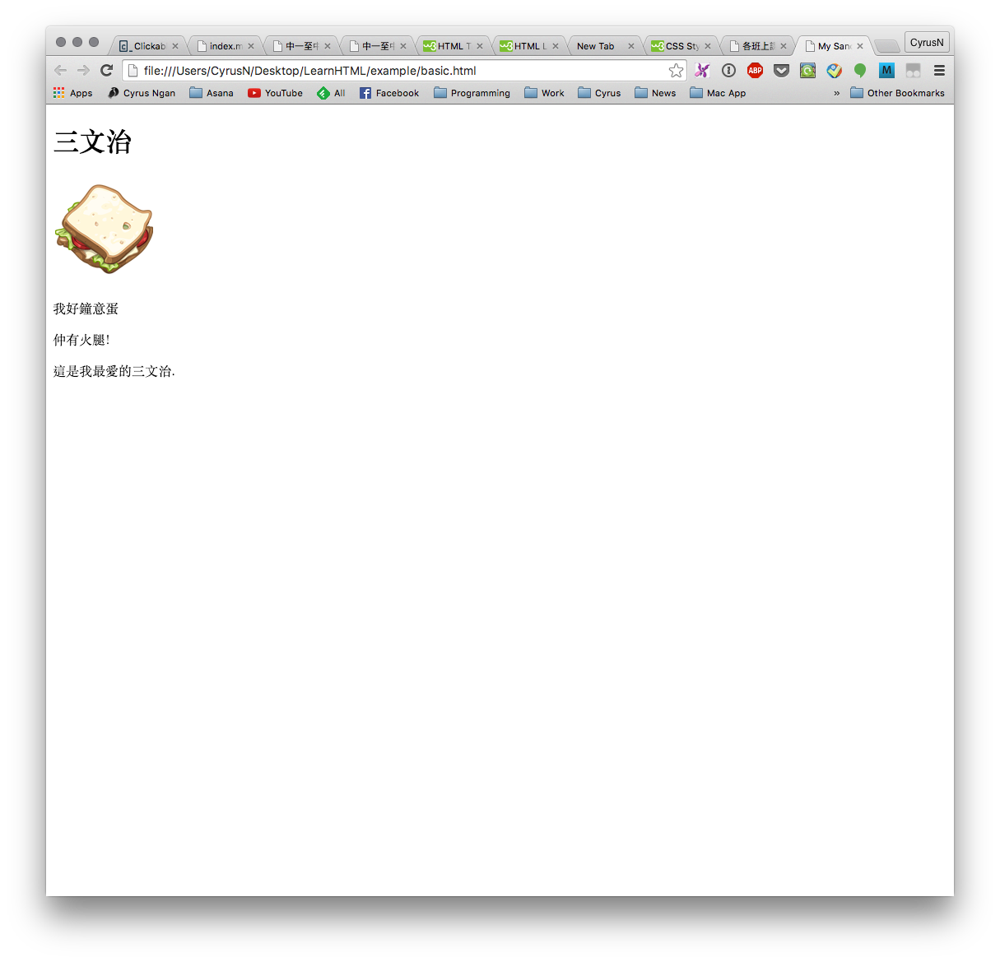
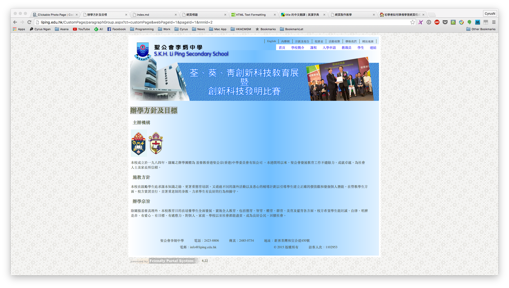
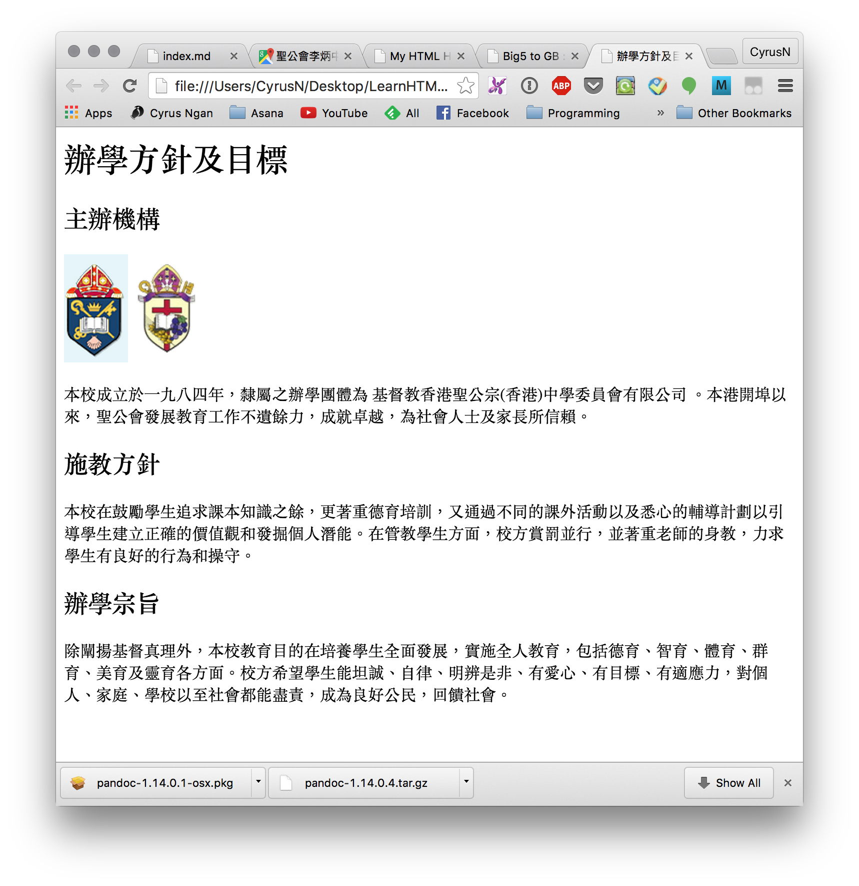

# 插入圖像 image
利用``標簽插入圖片，於`src`屬性內填上圖片的連結。

```html

```

例子：

``` html
<!DOCTYPE html>
<html>
  <head>
    <meta charset="utf8">
    <title>My Sandwiches</title>
  </head>
  <body>
    <h1>三文治</h1>
    
    <p>我好鐘意蛋</p>
    <p>仲有火腿!</p>
    <p>這是我最愛的三文治.</p>
  </body>
</html>
```

以上的`html`文件，於瀏覽器中開啟，便會得出以下結果。



## 堂課 1
仿照學校網頁中**辦學方針及目標**，制作一個`html`文本，文本名稱為 `heading.html`。

``` txt
P:/
└── html
    ├── basic.html
    └── heading.html
```

學校網頁：


堂課結果：


***題示1***：同學可到學校網頁，堂課所用的文字，可於網頁中複製使用。

***題示2***：文中的圖片的超連結，亦可於學校網頁，點擊右鍵，複製圖片超連結。

***題示3***：共有六個不同的HTML標題，`<h1>` - `<h6>` 標簽可定義標題。`<h1>`定義最大的標題。`<h6>`定義最小的標題。

``` html
<h1>hello</h1>
<h2>hello</h2>
<h3>hello</h3>
<h4>hello</h4>
<h5>hello</h5>
<h6>hello</h6>
```

同學可利用以下範本，完成`heading.html`。

```html
<html>
  <head>
    <meta charset="utf8">
    <title>This is title</title>
  </head>
  <body>
    <h1>Heading 1</h1>

    <h2>Heading 2</h2>
    
    
    <p>Lorem ipsum dolor sit amet, consectetur adipisicing elit, sed do eiusmod
    tempor incididunt ut labore et dolore magna aliqua. Ut enim ad minim veniam</p>

    <h2>Heading 2</h2>
    <p>quis nostrud exercitation ullamco laboris nisi ut aliquip ex ea commodo
    consequat. Duis aute irure dolor in reprehenderit in voluptate velit esse.</p>

    <h2>Heading 2</h2>
    <p>cillum dolore eu fugiat nulla pariatur. Excepteur sint occaecat cupidatat non
    proident, sunt in culpa qui officia deserunt mollit anim id est laborum.</p>
  </body>
</html>
```
