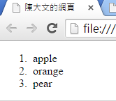
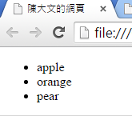
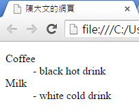
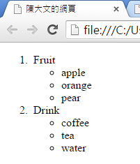
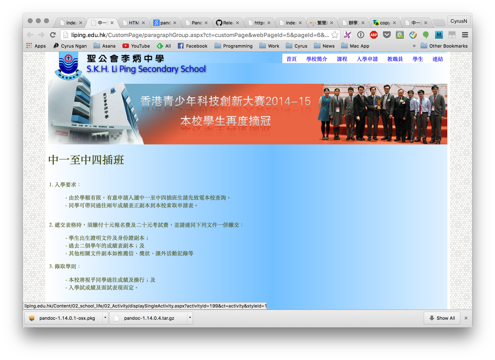
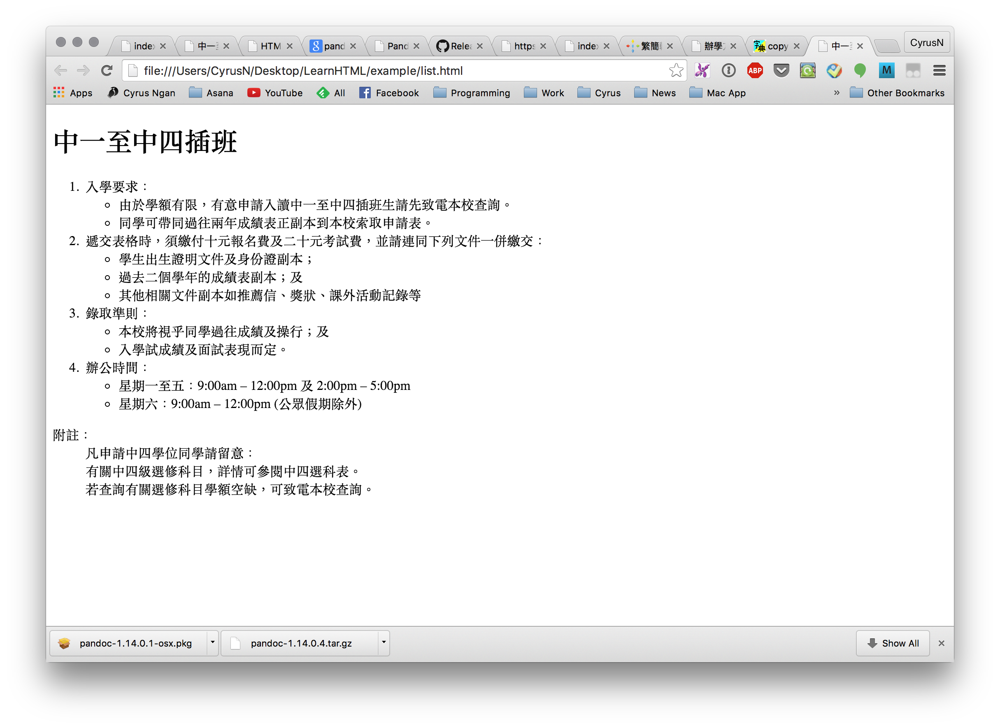

# 列表 lists
## 有序列表 ordered lists
以下為有序列表的例子及其標籤碼：



```html
<ol>
  <li>apple</li>
  <li>orange</li>
  <li>pear</li>
</ol>
```

## 無序列表 unordered lists
以下為無序列表的例子及其標籤碼：



```html
<ul>
  <li>apple</li>
  <li>orange</li>
  <li>pear</li>
</ul>
```

## 自定義列表 Description Lists
以下為自定義列表的例子及其標籤碼：



```html
<dl>
  <dt>Coffee</dt>
  <dd>- black hot drink</dd>
  <dt>Milk</dt>
  <dd>- white cold drink</dd>
</dl>
```

## 嵌套组合列表 Nested Lists
以下為嵌套组合列表的例子及其標籤碼：



```html
<ol>
  <li>Fruit</li>
    <ul>
      <li>apple</li>
      <li>orange</li>
      <li>pear</li>
    </ul>
  <li>Drink</li>
    <ul>
      <li>coffee</li>
      <li>tea</li>
      <li>water</li>
    </ul>
</ol>
```

## 堂課 2

仿照學校網頁中**中一至中四插班**，制作一個`html`文本，文本名稱為 `list.html`。

``` txt
P:/
└── html
    ├── basic.html
    ├── heading.html
    └── list.html
```

學校網頁：


堂課結果：

