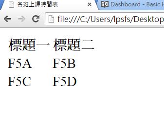
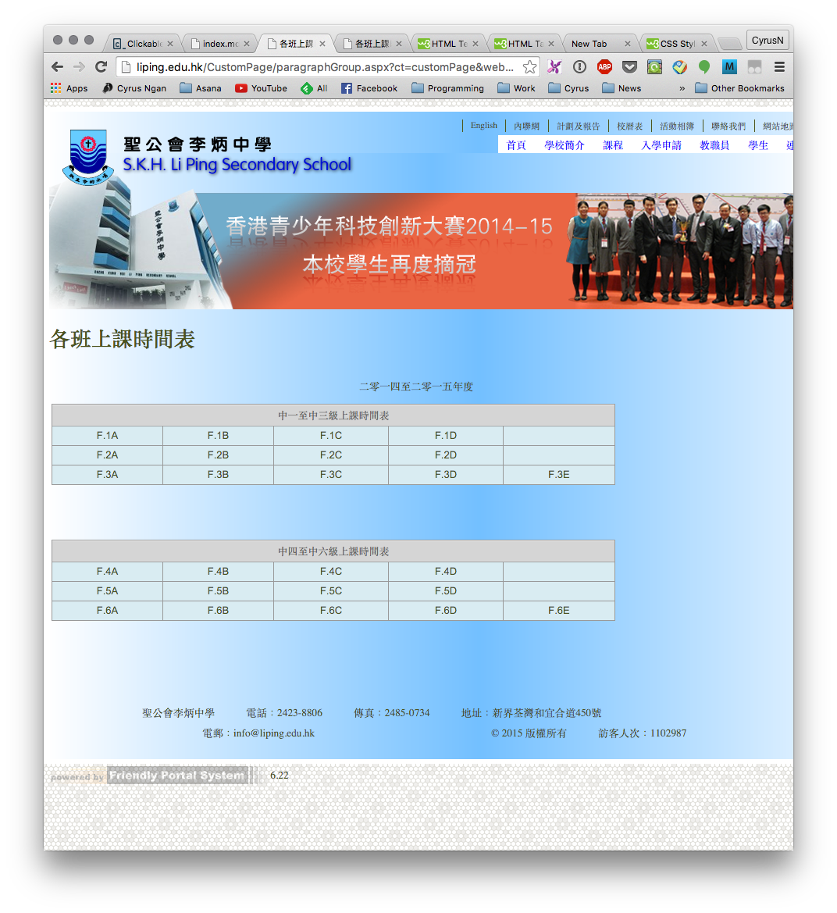
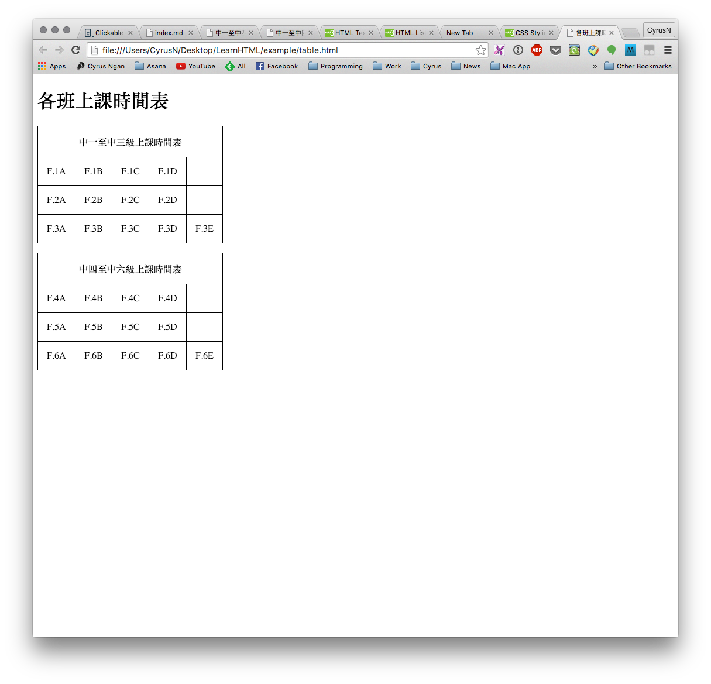

# 表格 table
以下為表格`table` 的結構

```html
<table>
  <tr>
    <th>標題一</th>
    <th>標題二</th>
  </tr>
  <tr>
    <td>F5A</td>
    <td>F5B</td>
  </tr>
  <tr>
    <td>F5C</td>
    <td>F5D</td>
  </tr>
</table>
```

- `<tr>`和`</tr>`內的文本，為表格的一行。
- `<th>`和`</th>`內的文本，為表格的標題列。
- `<td>`和`</td>`內的文本，為表格的一列。




# 表格框線 border
為了讓表格內容更清晰表達出來，我們可為表格加上框線。
以下新增了框線的表格標籤碼：

```html
<table>
  <tr>
    <th>標題一</th>
    <th>標題二</th>
  </tr>
  <tr>
    <td>F5A</td>
    <td>F5B</td>
  </tr>
  <tr>
    <td>F5C</td>
    <td>F5D</td>
  </tr>
</table>
```

合拼行 / 列
- 同學可利用屬性`colspan`合拼列
- 同學可利用屬性`rowspan`合拼行

例：

```html
<table>
  <tr>
    <th colspan="2">班別</th>
  </tr>
  <tr>
    <td>F5A</td>
    <td>F5B</td>
  </tr>
  <tr>
    <td>F5C</td>
    <td>F5D</td>
  </tr>
</table>
```

## 堂課三  

仿照學校網頁中 **課程 -> 各班上課時間表**，制作一個`html`文本，文本名稱為`table.html`。

``` txt
P:/
└── html
    ├── basic.html
    ├── heading.html
    ├── list.html
    └── table.html
```

學校網頁：


堂課結果：

