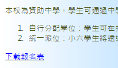
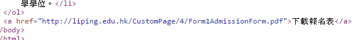

# 連結 link

插入超連結文字，可以用`<a>`標簽，超連結放於`href`屬性內，文字則在`<a>` 和`</a>`之間

例子：

``` html
<a href="http://liping.edu.hk">LPSS</a>
```

## 堂課四

仿照學校網頁中**中一自行分配學位**，製作一個`html`文本，文本名稱為`link.html`。

``` txt
P:/
└── html
    ├── basic.html
    ├── heading.html
    ├── list.html
    ├── table.html
    └── link.html
```

學校網頁：


堂課結果：


####堂課步驟提示
一. 先到學校網頁中的**中一自行分配學位**按「下載報名表」:



二. 然後複製「下載報名表」的連結，如下所示:


三. 把已複製的連結貼在你製作的`link.html`中:
