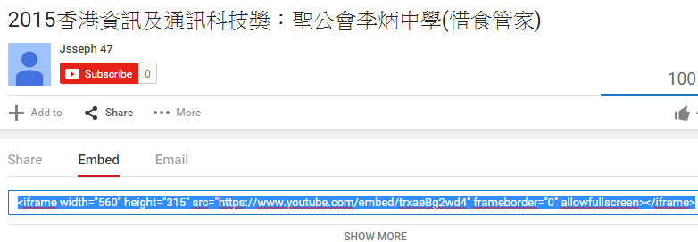

# 嵌入工具 iframe

Google Map、YouTube、facebook 還有很多網頁都設有嵌入工具。
只要直接將**嵌入連結**貼上 html 文件內即可。

```html
<iframe src="......."></iframe>
```
## 堂課五

仿照學校網頁中**聯絡我們**，製作一個`html`文本，文本名稱為`iframe.html`。

``` txt
P:/
└── html
    ├── basic.html
    ├── heading.html
    ├── list.html
    ├── table.html
    ├── link.html
    └── iframe.html
```

***題示1*** 同學於google map 中搜尋學校名稱，然後找找嵌入地圖的連結


學校網頁：


堂課結果：


##堂課六
同學製作一個`html`文本，用以嵌入影片於網頁，文本名稱為`iframe2.html`。

``` txt
P:/
└── html
    ├── basic.html
    ├── heading.html
    ├── list.html
    ├── table.html
    ├── link.html
    └── iframe2.html
```

***顯示2*** 同學於youtube中搜尋學校名稱，然後選擇搜尋結果中的其中一段影片，再找嵌入影片的連結




