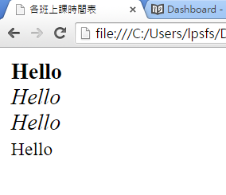
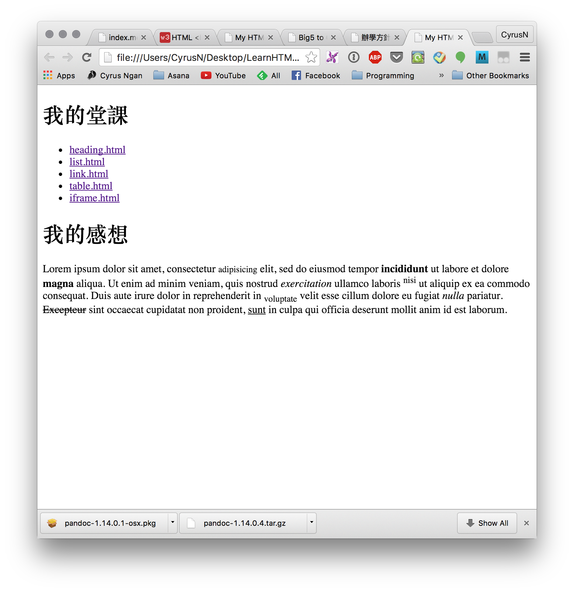

# 文字元素 formatting

|    標簽    | 用法 |
|------------|------|
| `<b>`  `</b>`      | 粗體 |
| `<em>` `</em>`    | 強調 |
| `<i>`  `</i>`    | 斜體 |
| `<small>` `</small>`  | 小型 |
| `<strong>` `</strong>` | 重點 |
| `<sub>` `</sub>` | 下標 |
| `<sup>` `</sup>`   | 上標 |
| `<ins>` `</ins>`    | 插入 |
| `<del>`  `</del>`  | 刪除 |
| `<mark>` `</mark>`   | 標記 |

例子：
```
<b>Hello</b><br>

<em>Hello</em><br>

<i>Hello</i><br>

<small>Hello</small><br>
```

## 堂課六

建立一個 `index.html`文本, 內容必須包括以下兩項。
- 所有`html`課業的超連結
- 關於`html`的感想，200字，而感 想中，必須使用以上文字元素。

``` txt
P:/
└── html
    ├── basic.html
    ├── heading.html
    ├── list.html
    ├── table.html
    ├── link.html
    └── index.html
```

提示：
1. 回到 Chapter2, 複製 堂課0 的 html 程式碼。
2. 
2. 在`<head>` `</head>`之間複製有關網頁風格的程式碼。
3. 製作表格的程式碼則可參考本課第一段程式碼。


