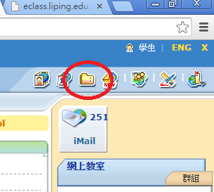
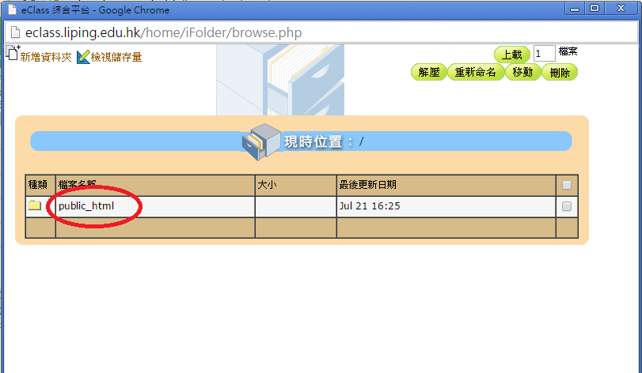

# 上載網頁

- 同學可把已製作的網頁放在學校內聯網的個人文件夾中(public_html)。

- 利用瀏覽器檢查網頁是否成功上載。
    - 網址：`http://eclass.liping.edu.hk/~lp_your_id`

# 上載步驟
- 步驟1
 
同學首先登入學校內聯網。

- 步驟2
 
登入學校內聯網後，同學按右上的「我的文件夾」。

- 步驟3
 
進入「我的文件」夾後，點擊「public_html」。

# 其他工具
- FTP (FileZilla)

