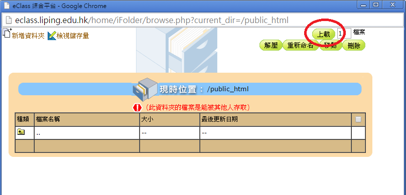

# 上載網頁

- 同學可把已製作的網頁放在學校內聯網的個人文件夾中(public_html)。

- 利用瀏覽器檢查網頁是否成功上載。
    - 網址：`http://eclass.liping.edu.hk/~lp_your_id/~file_name`

# 上載步驟
- 步驟1
 
同學首先登入學校內聯網。

- 步驟2
 
登入學校內聯網後，同學按右上的「我的文件夾」。

- 步驟3
 
點擊「public_html」。

- 步驟4
 
點擊右上方的「上載」。

- 步驟5
 
點擊「選擇檔案」。

- 步驟6
 
選擇所有需要上載的 html 文件，。

- 步驟7
 
利用瀏覽器檢查網頁是否成功上載。
    - 網址：http://eclass.liping.edu.hk/~lp_your_id/file_name
    - 例子：http://eclass.liping.edu.hk/~lp0711999/basic.html

# 其他工具
- FTP (FileZilla)

